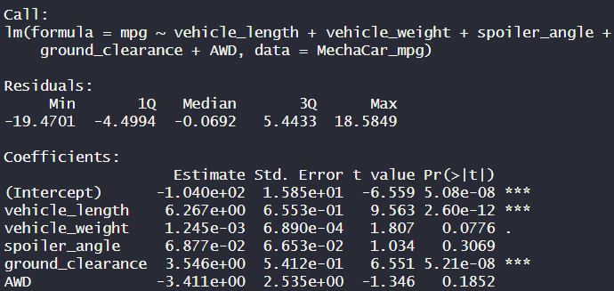
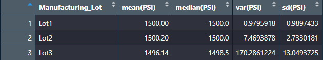
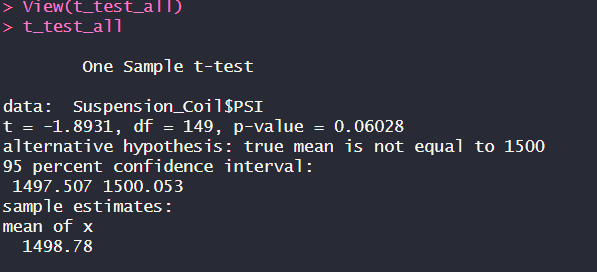
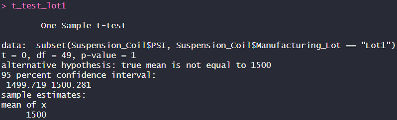
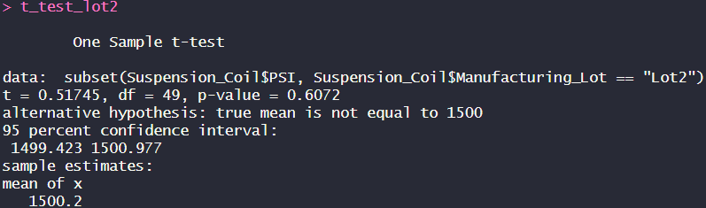
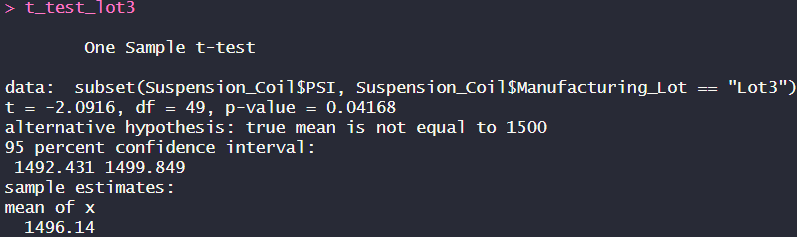

# MechaCar_Statistical_Analysis

The latest prototype from AutosRUs, the MechaCar, is facing production challenges that are hindering the progress of the manufacturing team. The objective of this analysis is to examine the production data to uncover insights that could assist the manufacturing team in overcoming these obstacles.

## Linear Regression to Predict MPG
From the output, some variables that provided a non-random amount of variance to the mpg values in the dataset are `vehicle_length` and `ground_clearance`.

The slope of the linear model is not considered to be zero, as some of the independent variables have significant p-values.

This linear model can predict the mpg of MechaCar prototypes effectively, as the r-squared value is relatively high, suggesting that the model accounts for a significant portion of the variance in the dependent variable (mpg).

## Suspension Coils Summary Statistics

While the overall manufacturing data adheres to the design specifications, individual lots display discrepancies. Specifically, Lot 3's variance surpasses the 100 PSI limit, reaching over 170 PSI.

## T-Tests on Suspension Coils

Based on the findings from the previous analysis, t-tests were conducted on a sample of the entire population of vehicles and on a sample from each lot, comparing them to the mean of the entire population.

### T-Test for All Car Lots

The findings above suggest that a random sample from all lots is marginally below the population average of 1500 PSI.

The data was then organized into subgroups for each lot to compare against the population mean.

### T-Tests for Individual Lots

#### T-Test for Lot 1

The p-value for this lot is extremely small, which implies that we possess sufficient evidence to reject the null hypothesis. Consequently, the two means are not statistically similar.

#### T-Test for Lot 2

The p-value for this T-Test is also very small, once again indicating that we have enough evidence to reject the null hypothesis. The mean of the lot and the mean of the entire population are not statistically similar.

#### T-Test for Lot 3

The p-value for this test is quite large, which means that we don't have enough evidence to reject the null hypothesis. The mean of Lot 3 and the mean of the population are similar. Given that previous tests have shown issues with the variance of PSI in Lot 3, we know that this production facility is significantly influencing the population mean. Therefore, efforts should be concentrated on addressing the issues faced in Lot 3 during the production of the MechaCar.

## Study Design: MechaCar vs Competition

The analyses conducted thus far have pinpointed areas that need improvement in order to address MechaCar's production challenges. It would also be advantageous to assess how MechaCar competes with other vehicles in the market. Emphasizing its fuel efficiency is a smart strategy, as this is a primary concern for car buyers in the target demographics.

In this context, it is suggested to have a null hypothesis stating that the innovative technology implemented in MechaCar results in the same highway fuel efficiency as other vehicles within its class. Conversely, the alternative hypothesis posits that MechaCar's advanced technology leads to enhanced fuel efficiency compared to similar vehicles.

To perform this analysis, it is recommended to use a multiple linear regression test, as multiple independent variables influence fuel efficiency. This approach will allow isolating the impact of MechaCar's advanced technology on fuel efficiency.

The dataset required for this analysis should encompass the specific technology employed in the MechaCar and other relevant factors known to impact fuel efficiency, such as engine type, tires, MPG, vehicle length, and ground clearance.
